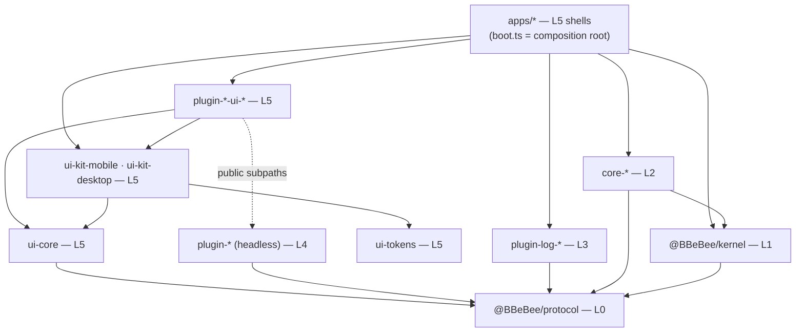

# Monorepo Layout & Layer Model Governance

> **Legacy Reference:** Formerly `docs/09-project-structure.md §1 – §3`.

> **What this answers.** The monorepo layout, the dependency rules that are mechanically enforced,
> how each target is built, the pinned version matrix, and the testing strategy that keeps the
> platform abstraction from rotting.

---

## 1. Repository layout

**The filesystem is the layer model.** Every package lives at
`packages/<layer>/<package>`, and the layer directory is not decoration: it is
what [`eslint.config.js`](#3-dependency-rules) keys its rules off. A package is governed by *where
it lives*, so moving one between layers is a `git mv` that changes its rules in the same commit.

```
packages/protocol/    Layer 0 — contracts, zero runtime
packages/kernel/      Layer 1 — infrastructure + system abstractions
packages/core/        Layer 2 — core capability services
packages/logs/        Layer 3 — log transports
packages/feature/     Layer 4 — business feature modules
packages/ui/          Layer 5 — views and shared UI infrastructure
packages/tooling/     outside the model — nothing here ships
```

Every package sits at the same depth, so `packages/*/*` is the whole workspace in one glob and
every package's `tsconfig.json` reaches the base config by the same `../../../`. The `apps/` are
Layer 5 too, but they stay where a reader expects to find them.

> ⚠️ **`packages/*/*` is not quite the whole workspace, and the exception has bitten.** The two
> single-package layers are `packages/protocol/src` and `packages/kernel/src`, one level
> shallower than everything else — so a glob written for the deep shape misses them, silently.
> `vitest.config.ts` carried only the deep shape for a while, and with it every test in Layers 0
> and 1: `layers.test.ts`, `conventions.test.ts`, `shells.test.ts` and
> `cordis-assumptions.test.ts` were not collected, and a run with the architecture's own guards
> switched off reports success exactly like one with them on. Any tool that globs packages needs
> both shapes.

Two consequences of naming the directories after the layer's *job* rather than its number. The
layers no longer sort into their own order — `core`, `feature`, `kernel`, `protocol`, `ui` is
alphabetical, and the table above is the mapping to know. And the two single-package layers read
doubled, `packages/protocol` and `packages/kernel`, which is the price of every
package sitting at one depth; the alternative special-cases exactly the two layers most likely to
gain a second package.

`✅` = built and passing `pnpm check`. Anything without it is designed but not yet written.

```
B_Be_Bee/
│
├── apps/                                   🔹 LAYER 5 — application shells
│   ├── mobile/                     ✅        Expo app
│   │   ├── src/boot.ts                        composition root: registers core-*-expo ([architecture/layers.md §1](../architecture/layers.md#1-the-layer-model))
│   │   ├── src/plugins.ts                     the allowlist, as data — imports nothing
│   │   ├── src/App.tsx                        mounts inside ctx.inject(['ui'], …)
│   │   ├── generated/plugins.ts               codegen: static plugin imports ([plugins/loading.md §6.1](../plugins/loading.md))
│   │   ├── app.json · index.js                Expo entry + config
│   │   ├── metro.config.js                    package exports + watchFolders ([build-pipelines.md §4](./build-pipelines.md#4-build-pipelines))
│   │   ├── babel.config.js
│   │   └── android/ · ios/                    dev-client native projects
│   └── desktop/                    ✅        Electron app
│       ├── main/                              IPC hosts only, no domain logic ([architecture/layers.md §2](../architecture/layers.md#2-the-two-shells))
│       ├── preload/                           contextBridge surface
│       ├── renderer/                          React DOM shell + the kernel (ADR-3)
│       │   ├── boot.ts · plugins.ts             composition root + allowlist
│       │   └── main.tsx · Shell.tsx             mount + chrome
│       └── electron.vite.config.ts
│
├── packages/
│   │
│   ├── protocol/                    🔹 LAYER 0 — the contract layer 
│   │       │                                 @BBeBee/protocol. ZERO runtime dependencies, no      
│   │       └── src/                          side effects, no platform access — which is what
│   │           │                             makes it safe to import from any layer, and the
│   │           │                             seam every layer is mocked at
│   │           ├── services/                 fs · http · db · secrets · audio · player ·
│   │           │                             sources · ui · … ([services/overview.md](../services/overview.md))
│   │           ├── entities/                 Track, Album, StreamHandle, TransportState … ([data-model/schema.md](../data-model/schema.md))
│   │           ├── events.ts                 the typed event map ([data-model/events.md](../data-model/events.md))
│   │           ├── errors.ts · frac-index.ts the small pure runtime that earns its place
│   │           └── conformance/              shared contract suites: one test file, run
│   │                                         against both implementations of a key ([services/contracts.md](../services/contracts.md))
│   │
│   ├── kernel/                      🔹 LAYER 1 — infrastructure + system abstractions  
│   │       │                                 @BBeBee/kernel. Depends on protocol and cordis,
│   │       └── src/                          and nothing else in the workspace — a kernel that
│   │           │                             knows which plugins exist is not one
│   │           ├── index.ts                  two surfaces, not equally available: the pinned
│   │           │                             Cordis re-exports are open to every layer, the
│   │           │                             bootstrap surface below them is Layer 2 + the
│   │           │                             composition root only ([architecture/layers.md §1](../architecture/layers.md#1-the-layer-model))
│   │           │                             ── by concern, tests beside their subject:
│   │           ├── bootstrap/                createApp, boot order, settling, shell wiring
│   │           ├── config/                   resolve, enable/disable, defaults
│   │           ├── loader/                   registry → ctx.plugin(), fiber-state reporting
│   │           ├── capability-gate/          scoping and the SQL guards ([plugins/capabilities.md §7](../plugins/capabilities.md#7-capability-model)). sql.ts is
│   │           │                             shared with apps/desktop/main, so one allowlist
│   │           │                             covers the gated path and the IPC host both
│   │           ├── migrations/               core schema migrations ([data-model/migrations.md](../data-model/migrations.md))
│   │           │                             ── and what belongs to no single concern:
│   │           ├── fiber-state.ts            the FiberState mirror upstream cannot export
│   │           ├── testing.ts                @BBeBee/kernel/testing — snapshotContext ([testing.md §6](./testing.md#6-testing-strategy))
│   │           └── *.test.ts                 conventions · layers · cordis-assumptions:
│   │                                         these scan the workspace, not the kernel
│   │
│   ├── core/                        🔹 LAYER 2 — core capability services
│   │   │                                      The ONLY packages permitted to import a platform
│   │   │                                      SDK, and the only ones permitted to drive the
│   │   │                                      kernel. One implementation per target per key;
│   │   │                                      no domain knowledge — none of them knows what a
│   │   │                                      track is.
│   │   ├── core-paths-node/        ✅        ctx.paths
│   │   ├── core-paths-expo/        ✅
│   │   ├── core-fs-node/           ✅        ctx.fs — virtual filesystem ([services/overview.md §1](../services/overview.md#1-virtual-filesystem-ctxfs))
│   │   ├── core-fs-expo/           ✅
│   │   ├── core-db-node/           ✅        ctx.db — node:sqlite / expo-sqlite ([services/contracts.md §3](../services/contracts.md#3-ctxdb--sqlite-database))
│   │   ├── core-db-expo/           ✅
│   │   ├── core-store-fs/          ✅        ctx.store — one impl, via ctx.fs ([services/contracts.md §4](../services/contracts.md#4-ctxstore--key-value-store))
│   │   ├── core-http-node/         ✅        ctx.http — the transport is a seam: desktop fills
│   │   ├── core-http-rn/           ✅          it with Electron's net, mobile with expo/fetch
│   │   ├── core-secrets-node/      ✅        ctx.secrets. ⚠️ named -node but platform-free: it
│   │   │                                       persists through ctx.fs, so it loads in
│   │   │                                       Electron's sandboxed renderer too
│   │   ├── core-secrets-expo/      ✅
│   │   ├── core-device-electron/   ✅        ctx.device — network, battery, media keys
│   │   ├── core-device-expo/       ✅
│   │   ├── core-background-electron/ ✅      ctx.background — wake locks, suspend
│   │   ├── core-background-expo/   ✅
│   │   ├── core-media-session-electron/ ✅   ctx.mediaSession — the OS now-playing surface
│   │   ├── core-media-session-rn/  ✅
│   │   ├── core-codec-node/        ✅        ctx.codec — tags via music-metadata over ctx.fs;
│   │   ├── core-codec-rn/          ✅          -rn adds the device's decoder
│   │   ├── core-audio-mpv/         ✅        ctx.audio — libmpv native engine (desktop subprocess)
│   │   ├── core-audio-webaudio/    ✅        ctx.audio — Web Audio API graph (shared) ([audio/engine.md §1](../audio/engine.md#1-ctxaudio--the-web-audio-engine))
│   │   ├── core-js-quickjs-node/   ✅        ctx.js — source sandbox ([services/contracts.md §19](../services/contracts.md#19-ctxjs--the-sandboxed-evaluator))
│   │   ├── core-js-quickjs-expo/             ⚠️ the one M2 gap: Hermes has no WASM
│   │   ├── core-desktop-bridge/    ✅        renderer↔main IPC clients + the main-side host.
│   │   │                                       Layer 2 on both sides of the process boundary
│   │   └── core-…                            ctx.ws · ctx.notify · ctx.crypto · ctx.shell
│   │
│   ├── logs/                        🔹 LAYER 3 — log transports
│   │   │                                      Cordis exporters, shared across platforms, that
│   │   │                                      decide where a line ends up. The only layer that
│   │   │                                      may write to the console; everything above it
│   │   │                                      logs through ctx.logger ([services/logging.md §16](../services/logging.md#16-ctxlogger-and-log-transports)). Loaded from
│   │   │                                      each shell's bootstrap array, so they are running
│   │   │                                      before the first feature plugin starts.
│   │   ├── plugin-log-buffer/      ✅        ctx.logBuffer — the ring the log viewer reads
│   │   ├── plugin-log-console/     ✅        development only: console.* with scoped prefixes
│   │   └── plugin-log-file/        ✅        shipped builds only: rotating NDJSON via ctx.fs
│   │
│   ├── feature/                     🔹 LAYER 4 — business feature modules
│   │   │                                      One business capability each, headless: state,
│   │   │                                      persistence, networking, events. Import
│   │   │                                      @BBeBee/protocol and the kernel's plugin surface
│   │   │                                      — never a platform SDK, never a core-* package
│   │   │                                      (a Layer 2 dependency is `inject: ['fs']`), and
│   │   │                                      never a transport (logging is `ctx.logger`).
│   │   ├── source-rules/           ✅        the rule language as pure logic: no Cordis, no
│   │   │                                       platform, no I/O ([sources/rule-engines.md §3](../sources/rule-engines.md#3-rule-language)). parse.ts the parser,
│   │   │                                       evaluate.ts the engine and its coercion,
│   │   │                                       jsonpath.ts · template.ts the two dialects,
│   │   │                                       regex-guard.ts the ReDoS bound
│   │   ├── toolkit/                ✅        root: pure helpers that outgrew one plugin — stable
│   │   │                                       ids (stableId, artworkId), splitArtists,
│   │   │                                       formatDuration, formatTotalDuration, permute.
│   │   │                                       Same charter as source-rules — no Cordis,
│   │   │                                       no I/O, no deps. `./hooks`: the shared React
│   │   │                                       service bindings (serviceOf, useServiceState,
│   │   │                                       useTransport, useResolvedArtwork, …) so a view
│   │   │                                       never imports another feature for one
│   │   ├── plugin-source-runtime/  ✅        binds source-rules to ctx.http · ctx.js ([sources/runtime.md §4](../sources/runtime.md#4-source-runtime))
│   │   ├── plugin-sources/         ✅        ctx.sources registry + catalogue ([sources/runtime.md §4.1](../sources/runtime.md#41-catalog-aggregation))
│   │   ├── plugin-album/           ✅        the album page: route + view id, reads through
│   │   │                                       ctx.sources ([data-model/schema.md](../data-model/schema.md), [ui/architecture.md §2](../ui/architecture.md#2-descriptors-not-components))
│   │   ├── plugin-source-local/    ✅        the one provider that is not a string ([sources/authoring.md §12](../sources/authoring.md#12-what-is-not-a-string-local-files))
│   │   ├── plugin-local-scanner/   ✅        ctx.scanner — the ≥5,000-file corpus walk
│   │   ├── plugin-player/          ✅        ctx.player — transport, queue, history ([audio/playback.md §2](../audio/playback.md#2-ctxplayer--transport-state-machine))
│   │   ├── plugin-now-playing/     ✅        the "what is playing" surfaces: the full-screen
│   │   │                                       player and the bar that opens it ([audio/playback.md](../audio/playback.md), [ui/architecture.md §4](../ui/architecture.md#4-binding-services-to-react))
│   │   ├── plugin-queue/           ✅        the up-next list, a view of ctx.player's queue
│   │   ├── plugin-history/         ✅        ctx.player playback history and deduplicated records
│   │   ├── plugin-ui/              ✅        ctx.ui contribution registry — descriptors
│   │   │                                       only, so it holds no React ([ui/architecture.md §2](../ui/architecture.md#2-descriptors-not-components))
│   │   ├── plugin-inspector/       ✅        fiber tree + labelled effects (M0 exit criterion)
│   │   ├── plugin-dsp/             ✅        ctx.dsp — the effect chain, 9 built-in effects ([audio/dsp.md §3](../audio/dsp.md#3-ctxdsp--the-effect-chain))
│   │   ├── plugin-download/        ✅        ctx.downloads — the task queue, the kept-downloads
│   │   │                                       directory, If-Range resume, the Wi-Fi/charging
│   │   │                                       policy, and before-resolve substitution ([audio/playback.md](../audio/playback.md), [data-model/schema.md](../data-model/schema.md))
│   │   ├── plugin-library/         ✅        ctx.library — playlists, favourites, smart lists,
│   │   │                                       collections ([data-model/schema.md](../data-model/schema.md))
│   │   ├── plugin-lyrics/          ✅        ctx.lyrics — lyric cache, source resolution and sync
│   │   ├── plugin-lyric-sources/   ✅        ctx.lyricSources — third-party external lyric sources
│   │   ├── plugin-desktop-lyrics/  ✅        ctx.desktopLyrics — floating/secondary window lyrics
│   │   ├── plugin-desktop-taskbar/ ✅        Windows taskbar thumbnail toolbar (play/pause/prev/next)
│   │   ├── plugin-visualizer/      ✅        ctx.visualizer — real-time audio FFT/waveform analysis service
│   │   ├── plugin-mini-player/     ✅        ctx.miniPlayer — floating mini player and Dynamic Island
│   │   ├── plugin-settings/        ✅        ctx.settings — user preferences and dynamic contribution registry
│   │   ├── plugin-share/           ✅        ctx.share — metadata serialization, steganography, track sharing
│   │   ├── plugin-sleep-timer/     ✅        ctx.sleepTimer — countdown sleep timer service
│   │   ├── plugin-theme/           ✅        ctx.theme — theme registry and token DOM/store synchronization
│   │   ├── plugin-manager/         ✅        ctx['plugin-manager'] — plugin registry and runtime lifecycle
│   │   ├── plugin-cache/           ✅        ctx.cache — covers and remote streams served from
│   │   │                                       ctx.paths.cache, fetched only on a miss, LRU per
│   │   │                                       class ([audio/playback.md](../audio/playback.md), [data-model/schema.md](../data-model/schema.md))
│   │   └── plugin-…
│   │
│   ├── ui/                          🔹 LAYER 5 — views and UI infrastructure
│   │   │                                      Layout, gestures, event wiring, and the
│   │   │                                      orchestration that turns one user intent into a
│   │   │                                      sequence of feature calls. Anything you would
│   │   │                                      otherwise write twice belongs in the headless
│   │   │                                      sibling, which views import through its public
│   │   │                                      subpaths only (types, hooks, view ids).
│   │   ├── ui-tokens/              ✅        design tokens as data + WCAG AA gate ([ui/design-system.md](../ui/design-system.md))
│   │   ├── ui-core/                ✅        view-generic surface (identicon + shared prop
│   │   │                                       types); re-exports the toolkit/hooks bindings
│   │   ├── ui-menus/               ✅        context-menu models shared by both shells: the
│   │   │                                       actions for a track, playlist and collection
│   │   ├── ui-parity/              ✅        the component contract, and the check that both
│   │   │                                       kits meet it ([ui/design-system.md](../ui/design-system.md))
│   │   ├── ui-kit-mobile/          ✅        React Native components
│   │   ├── ui-kit-desktop/         ✅        React DOM components (modular components & theme)
│   │   ├── plugin-queue-ui-desktop/  ✅      ┐ the up-next queue
│   │   ├── plugin-queue-ui-mobile/   ✅      ┘
│   │   ├── plugin-history-ui-desktop/ ✅     ┐ playback history view and deduplication
│   │   ├── plugin-history-ui-mobile/  ✅     ┘
│   │   ├── plugin-now-playing-ui-desktop/ ✅ ┐ full-screen player + bar / mini-player
│   │   ├── plugin-now-playing-ui-mobile/  ✅ ┘
│   │   ├── plugin-sources-ui-desktop/ ✅     ┐ search, source list, import review,
│   │   ├── plugin-sources-ui-mobile/  ✅     ┘ test screen (modular screens) ([ui/architecture.md §4](../ui/architecture.md#4-binding-services-to-react))
│   │   ├── plugin-album-ui-desktop/  ✅      ┐ one album: header, tracks, actions ([ui/architecture.md §4](../ui/architecture.md#4-binding-services-to-react))
│   │   ├── plugin-album-ui-mobile/   ✅      ┘
│   │   ├── plugin-download-ui-desktop/ ✅    ┐ the download queue and cache ([ui/architecture.md §4](../ui/architecture.md#4-binding-services-to-react))
│   │   ├── plugin-download-ui-mobile/  ✅    ┘
│   │   ├── plugin-library-ui-desktop/ ✅     ┐ the library (playlists, albums, collections),
│   │   ├── plugin-library-ui-mobile/  ✅     ┘ one playlist, one collection, favourites (modular screens & modals) ([ui/architecture.md §4](../ui/architecture.md#4-binding-services-to-react))
│   │   ├── plugin-local-scanner-ui-desktop/ ✅ ┐ settings: scan roots
│   │   ├── plugin-local-scanner-ui-mobile/  ✅ ┘
│   │   ├── plugin-inspector-ui-desktop/ ✅   the fiber tree, rendered
│   │   ├── plugin-lyrics-ui-desktop/ ✅      now-playing lyrics panel, smooth auto-scrolling
│   │   ├── plugin-desktop-lyrics-ui-desktop/ ✅ desktop lyrics button + secondary window adapter
│   │   ├── plugin-visualizer-ui-desktop/ ✅  audio visualizer canvas and settings configuration panel
│   │   ├── plugin-mini-player-ui-desktop/ ✅ desktop floating mini player & Dynamic Island secondary window
│   │   ├── plugin-share-ui-desktop/   ✅     ┐ share card export and image steganography modals
│   │   ├── plugin-share-ui-mobile/    ✅     ┘
│   │   ├── plugin-theme-ui-desktop/   ✅     dynamic theme switcher, token editor, custom theme importer
│   │   ├── plugin-dsp-ui-desktop/  ✅        ┐ 10-band EQ sliders, chain ordering, effect bypass,
│   │   ├── plugin-dsp-ui-mobile/   ✅        ┘ and settings integration ([ui/architecture.md §4](../ui/architecture.md#4-binding-services-to-react))
│   │   ├── plugin-settings-ui-desktop/ ✅    ┐ settings center: modular sections & diagnostics,
│   │   └── plugin-settings-ui-mobile/  ✅    ┘ and category tabs ([ui/architecture.md §5](../ui/architecture.md))
│   │
│   ├── sdk/                         🔧 OUTSIDE THE LAYER MODEL
│   │                                         @BBeBee/sdk — public development kit for external plugins
│   │
│   └── tooling/                            🔧 OUTSIDE THE LAYER MODEL
│       │                                      Development aids. Nothing here ships in an app
│       │                                      bundle, which is why the layer rules do not
│       │                                      apply to them.
│       ├── tooling-check-changed/  ✅        fast diff-only verification CLI (pnpm check:changed)
│       ├── tooling-gen-plugins/    ✅        the static registry codegen (pnpm gen:plugins)
│       ├── tooling-create-plugin/  ✅        the scaffolder (pnpm new:plugin)
│       └── tooling-fixtures/       ✅        the ≥5,000-file corpus generator, an instrumented
│                                             ctx.fs, and the byte-serving http fixture the
│                                             conformance suite runs on
│
├── fixtures/sources/                         compiled single-file example source documents; golden corpus ([testing.md §6](./testing.md#6-testing-strategy))
├── scripts/                                  developer & build scripts (scripts/sources/ source packaging & watch tools)
├── test/stubs/                               the three native modules Node cannot load, aliased
│                                             by vitest.config.ts: react-native-audio-api throws
│                                             on anything genuinely native, expo-sqlite and
│                                             expo-file-system really work ([testing.md §6](./testing.md#6-testing-strategy))
├── docs/                                     these documents
├── eslint.config.js                          flat config; the layer rules live here ([#3-dependency-rules](#3-dependency-rules))
├── tsconfig.base.json                        every package tsconfig extends this
├── vitest.config.ts · vitest.global.ts       aliases + the scratch root each run allocates under
├── pnpm-workspace.yaml · .npmrc
└── package.json                              the root scripts: check, gen:plugins, new:plugin, build:sources, watch:sources
```

### Why the layer is a directory

The alternative — a flat `packages/` where the *prefix* carries the layer — is what this
repository had until the layer model was enforced, and it worked. What it could not do is make the
layer **structural**. Three things changed when the directory became the grouping:

- **The lint rules key off location, not spelling.** `packages/core/**` is the set of
  packages allowed to touch a platform SDK, and membership is a fact about the filesystem rather
  than a naming convention that a package called `plugin-fs-helper` could quietly slip past.
- **A layer change is a move.** Promoting a feature plugin into a core service is
  `git mv packages/feature/x packages/core/x`, and its rules change with it, in the
  same commit, visibly in review.
- **A new package must choose.** The scaffolder writes into `feature/` or `ui/`
  ([testing.md §7](./testing.md#7-developer-workflow)), so "which layer is this?" is answered at creation instead of
  being inferred later from what the package ended up importing.

The cost is one extra path segment everywhere — in `pnpm-workspace.yaml`, in each package's
`extends`, and in the workspace-scanning tests, which now resolve a package by scanning
`packages/*/*` rather than by joining a name onto `packages/`. That cost is paid once, and it was
paid when this layout landed. The scanners take the directory listing as the source of truth
rather than a hardcoded list, so the layer directories can be renamed — as they were, from
`layerN-*` to the bare name — without touching them.

Nesting also earns its keep *inside* a package, where it separates things a reader genuinely
confuses: `src/services/` and `src/entities/` in `protocol`, and the concern directories in
`kernel` — `bootstrap/`, `config/`, `loader/`, `capability-gate/`, `migrations/`. The kernel is
the one package doing five unrelated jobs, and each directory keeps its own tests beside it.

### Naming

The **directory** decides the layer and therefore what a package may import. The **prefix**
still says what kind of thing it is, and the two agree by construction — a `core-` package in
`feature/` would be a mistake the reader can see.

| Directory | Layer | Prefixes it holds |
|---|---|---|
| `protocol/` | 0 | `protocol` — the contracts. One package, no runtime |
| `kernel/` | 1 | `kernel` — one package |
| `core/` | 2 | `core-<service>-<platform>` — one platform implementation of a core service |
| `feature/` | 4 | `plugin-<feature>` headless, `plugin-effect-<id>` for a DSP effect, and `source-rules` · `toolkit` — pure-logic libraries beneath the plugins rather than plugins themselves (`toolkit` root; its `./hooks` subpath carries the shared React service bindings) |
| `ui/` | 5 | `plugin-<feature>-ui-<target>` for views, `ui-*` for the infrastructure both kits share |
| `sdk/` | — | `sdk` — public development kit for external plugins. Outside the layer model |
| `tooling/` | — | `tooling-*`. Outside the layer model, because nothing here ships |

There is deliberately **no `plugin-source-<protocol>` prefix any more**. A music backend is a
source document ([sources/spec.md](../sources/spec.md)), not a package. The only two packages with `source`
in the name are `plugin-source-runtime`, which interprets documents, and `plugin-source-local`,
which has no HTTP to describe ([sources/authoring.md §12](../sources/authoring.md#12-what-is-not-a-string-local-files)).
The example documents this repository ships live in `fixtures/sources/`, not in `packages/`.

`toolkit` shares `source-rules`' shape — **no manifest, so no lifecycle**: it is imported directly
by whichever package needs it, coupling nothing. The charter is two-part. The **root** is pure,
dependency-free logic — a library never names a `ctx.*` service; the moment code needs one, it
belongs in a `plugin-<feature>` package. The **`./hooks` subpath** is the one deliberate exception:
the shared React bindings that read services on behalf of every view package, addressed through
service keys and typed events only — it imports no `plugin-*` package, so a view binding to the
transport never has to import the player feature.

---

## 2. Package layering

The same six layers as [architecture/layers.md §1](../architecture/layers.md#1-the-layer-model), drawn as the actual
`package.json` graph. Every node is annotated with its layer, and every edge here is a real
`dependencies` entry — the runtime edges that service keys create are deliberately absent, because
this is the build graph.



Every arrow that is not into `@BBeBee/protocol` is a convenience. The arrows *into* `protocol` are
the architecture.

Two edges are worth reading twice, because they are the ones the layer model constrains rather
than forbids:

- **`apps/* → @BBeBee/kernel` and `apps/* → core-*`** exist only for the composition root — the
  `boot.ts` / `plugins.ts` pair per shell. Every other file under `apps/*` is plain Layer 5 and is
  linted as such ([§3](#3-dependency-rules)).
- **`apps/* → plugin-log-*`** is the same exception for the same reason. The transports are
  bootstrap entries, not registry ones — they come up after the core services and before the
  feature plugins, which is what Layer 3 *means* — and only the composition root may name a
  plugin by import. Nothing else in the repository imports a transport; everything logs through
  `ctx.logger` ([services/logging.md](../services/logging.md)).
- **`core-* → @BBeBee/kernel`** is the one place the bootstrap surface is imported by a package
  rather than by a shell: `core-db-*` runs the core migrations and scopes contexts for the
  capability gate. That is Layer 2 doing its job as the adaptation layer.

There is no `plugin-* → core-*` edge, on purpose, and no `plugin-* → plugin-log-*` edge either.
If one ever appears, the layer model is broken and `pnpm lint` says so — with
`layers.test.ts` behind it, because a lint pattern that matches nothing forbids nothing and reads
exactly like one that works.

---

## 3. Dependency rules

The layer model of [architecture/layers.md §1](../architecture/layers.md#1-the-layer-model) is worth exactly as much as its
enforcement, so it is enforced by ESLint with `overrides` scoped by path, not by review. Because
[§1](#1-repository-layout) puts every package under its layer directory, those paths *are* the
layer: `packages/core/**` is not a naming convention that hopes to match the right
packages, it is exactly the set of packages in Layer 2. Each rule below states which boundary it
protects. This is an abridged reading of `eslint.config.js` — the file itself is the authority.

```js
// eslint.config.js — the rules that matter
const PLATFORM_SDKS = [
  'expo', 'expo-*', 'expo/*', 'react-native', 'react-native/*', 'react-native-*',
  'electron', 'electron/*', 'node:*', 'fs', 'fs/promises', 'path', 'os', 'crypto',
  'child_process', 'better-sqlite3', 'music-metadata', 'ws',
]

// architecture/layers.md §1 — the kernel's plugin surface: the pinned Cordis re-exports, which
// only *type* a plugin. An allow-list rather than a ban-list on the bootstrap
// surface, so a new kernel export is closed to Layers 3, 4 and 5 by default.
const KERNEL_PLUGIN_SURFACE = [
  'Context', 'Service', 'Inject', 'FiberState', 'fiberStateName', 'isActive', 'isSettled',
  'Plugin', 'Fiber', 'Effect', 'EffectMeta', 'InjectSpec', 'FiberStateName', 'FiberStateValue',
]

const KERNEL_GUARD = {
  name: '@BBeBee/kernel',
  allowImportNames: KERNEL_PLUGIN_SURFACE,
  message: 'Layers 3, 4 and 5 may be typed by the kernel but may not drive it. See docs/architecture/layers.md §1.',
}

// Both forms: a gitignore-style `*` does not cross a `/`, so the bare name
// alone would let `@BBeBee/core-desktop-bridge/main` through.
const CORE_PACKAGES = ['@BBeBee/core-*', '@BBeBee/core-*/**']

// services/logging.md — Layer 3. Everything above it logs through `ctx.logger`, so nothing
// above it names a transport: an import pins one implementation into code
// whose point is not to know, and keeps it loaded for as long as the importer
// lives.
const LOG_PACKAGES = ['@BBeBee/plugin-log-*', '@BBeBee/plugin-log-*/**']

// The composition root: the only files that may call createApp and name a
// Layer 2 package by import. `apps/mobile/generated/plugins.ts` is codegen and is
// in the global `ignores`.
const COMPOSITION_ROOT = [
  'apps/mobile/src/boot.ts', 'apps/mobile/src/plugins.ts',
  'apps/desktop/renderer/boot.ts', 'apps/desktop/renderer/plugins.ts',
]

export default tseslint.config(
  {
    // architecture/layers.md §1 — Layers 4 and 5, addressed by directory. Every invariant at once,
    // because ESLint *replaces* a rule's options rather than merging them:
    // every block covering a file has to restate the whole ban, or the
    // narrower block silently disables the wider one.
    files: ['packages/feature/**/*.{ts,tsx}', 'packages/ui/**/*.{ts,tsx}',
            'packages/protocol/**/*.ts'],
    ignores: ['packages/ui/plugin-*-ui-*/**/*.{ts,tsx}'],
    rules: {
      'no-restricted-imports': ['error', {
        paths: [KERNEL_GUARD],
        patterns: [...PLATFORM_SDKS, ...CORE_PACKAGES, ...LOG_PACKAGES],
      }],
      // services/logging.md — the other half of the same rule. A line written straight to
      // the console skips the redactor and reaches neither the ring buffer nor
      // the log file, which are what a bug report carries.
      'no-console': 'error',
    },
  },
  {
    // architecture/layers.md §1 — Layer 3 itself. Bound by THE invariant like everything above
    // core, and exempt from `no-console`, which is the layer's job: it is the
    // whole of plugin-log-console, and plugin-log-file's last resort when the
    // write it exists to perform is the thing that failed.
    //
    // The negated pair is load-bearing. An extglob (`plugin-!(log-)*`) parses,
    // matches nothing, and bans nothing while looking correct.
    files: ['packages/logs/**/*.ts'],
    ignores: ['packages/logs/**/*.test.ts'],
    rules: {
      'no-restricted-imports': ['error', {
        paths: [KERNEL_GUARD],
        patterns: [...PLATFORM_SDKS, ...CORE_PACKAGES,
                   '@BBeBee/plugin-*', '@BBeBee/plugin-*/**',
                   '!@BBeBee/plugin-log-*', '!@BBeBee/plugin-log-*/**',
                   '@BBeBee/ui-*', '@BBeBee/ui-*/**'],
      }],
    },
  },
  {
    // architecture/layers.md §1 and sources/rule-engines.md — the rule engine is pure logic: no platform, no I/O,
    // and no Cordis. It takes a document and a string and returns a value;
    // every fetch belongs to plugin-source-runtime. Keeping it pure is what
    // makes the rule corpus runnable without a network, and it is the
    // Layer 4 entry in architecture/layers.md's testability table.
    files: ['packages/feature/source-rules/**/*.ts'],
    rules: {
      'no-restricted-imports': ['error', {
        patterns: [...PLATFORM_SDKS, ...CORE_PACKAGES, ...LOG_PACKAGES,
                   'cordis', '@BBeBee/kernel'],
      }],
    },
  },
  {
    // ui/architecture.md §1 — Layer 5 view packages may render, but may not reach the
    // platform. `react-native` is allowed; its capability modules are not.
    files: ['packages/ui/plugin-*-ui-mobile/**/*.{ts,tsx}',
            'packages/ui/ui-kit-mobile/**/*.{ts,tsx}'],
    rules: {
      'no-restricted-imports': ['error', {
        paths: [KERNEL_GUARD],
        patterns: [...PLATFORM_SDKS.filter((p) => !p.startsWith('react-native')),
                   ...CORE_PACKAGES, ...LOG_PACKAGES],
      }],
      'no-console': 'error',
    },
  },
  {
    // The desktop half. `react-dom` is not a platform SDK, so this one bans
    // the whole list — without it, the block above exempts every
    // `plugin-*-ui-*` package and only puts `-ui-mobile` back under a rule.
    files: ['packages/ui/plugin-*-ui-desktop/**/*.{ts,tsx}',
            'packages/ui/ui-kit-desktop/**/*.{ts,tsx}'],
    rules: {
      'no-restricted-imports': ['error', {
        paths: [KERNEL_GUARD],
        patterns: [...PLATFORM_SDKS, ...CORE_PACKAGES, ...LOG_PACKAGES],
      }],
      'no-console': 'error',
    },
  },
  {
    // architecture/layers.md §1 — Layer 1 depends on Layer 0 and nothing else. A kernel that knows
    // which plugins exist is not a kernel: it resolves them from a registry
    // the shell hands it, which is what lets one kernel boot two graphs.
    // `src/testing.ts` is exempt for the reason `*.test.ts` is.
    files: ['packages/kernel/src/**/*.ts'],
    ignores: ['packages/kernel/src/**/*.test.ts',
              'packages/kernel/src/testing.ts'],
    rules: {
      'no-restricted-imports': ['error', {
        patterns: [...PLATFORM_SDKS, ...CORE_PACKAGES,
                   '@BBeBee/plugin-*', '@BBeBee/plugin-*/**', '@BBeBee/ui-*', '@BBeBee/ui-*/**'],
      }],
    },
  },
  {
    // architecture/layers.md §1 — Layer 0 must stay runtime-free so it is safe to import anywhere,
    // which is what makes it the seam every other layer is mocked at.
    // `^[^.]` matches bare specifiers only, leaving relative imports alone.
    files: ['packages/protocol/src/**/*.ts'],
    ignores: ['packages/protocol/src/conformance/**/*.ts',
              'packages/protocol/src/**/*.test.ts'],
    rules: {
      'no-restricted-imports': ['error', {
        patterns: [{ regex: '^[^.]', allowTypeImports: true }],
      }],
    },
  },
  {
    // architecture/layers.md §1 — the shells are Layer 5 and reach Layers 2 and 3 through service
    // keys. Platform SDKs are deliberately NOT banned: a shell owns genuinely
    // platform-bound chrome ([ui/architecture.md §7](../ui/architecture.md)). What it may not do is skip a layer.
    //
    // `no-console` is not set here either, and that is deliberate: a shell has
    // to be able to report a failure that happened before any transport was
    // loaded — a core service throwing means there is no ring buffer to read
    // back and no file being written.
    files: ['apps/mobile/src/**/*.{ts,tsx}', 'apps/desktop/renderer/**/*.{ts,tsx}'],
    ignores: [...COMPOSITION_ROOT, '**/*.test.{ts,tsx}'],
    rules: {
      'no-restricted-imports': ['error', {
        paths: [KERNEL_GUARD], patterns: [...CORE_PACKAGES, ...LOG_PACKAGES],
      }],
    },
  },
  {
    // architecture/layers.md §2 — main is an IPC host. Domain logic there breaks platform symmetry,
    // and it would put Layer 4 concerns below Layer 2.
    files: ['apps/desktop/main/**/*.ts'],
    rules: { 'no-restricted-imports': ['error', { patterns: ['@BBeBee/plugin-*'] }] },
  },
  {
    // Tests are not shipped, so the SDK ban does not apply: a conformance
    // harness legitimately needs `node:fs` to build a scratch directory, and
    // a plugin's test legitimately loads a real core service to run against.
    files: ['**/*.test.{ts,tsx}'],
    rules: { 'no-restricted-imports': 'off', 'no-console': 'off' },
  },
)
```

Read as a matrix, that is the layer model with nothing left implicit:

| | Layer 0 `protocol/` | Layer 1 `kernel/` | Layer 2 `core/` | Layer 3 `logs/` | Layer 4 `feature/` | Layer 5 `ui/`, `apps/*` | Platform SDK | `console.*` |
|---|---|---|---|---|---|---|---|---|
| **Layer 0** may import | — | ❌ | ❌ | ❌ | ❌ | ❌ | ❌ | ❌ |
| **Layer 1** may import | ✅ | — | ❌ | ❌ | ❌ | ❌ | ❌ | ❌ |
| **Layer 2** may import | ✅ | ✅ **all of it** | own package | ❌ | ❌ | ❌ | ✅ **only here** | ❌ |
| **Layer 3** may import | ✅ | ⚠️ plugin surface only | ❌ *(service keys instead)* | a sibling transport | ❌ | ❌ | ❌ | ✅ **only here** |
| **Layer 4** may import | ✅ | ⚠️ plugin surface only | ❌ *(service keys instead)* | ❌ *(`ctx.logger`)* | types only, of a sibling | ❌ | ❌ | ❌ |
| **Layer 5** may import | ✅ | ⚠️ plugin surface only | ❌ *(service keys instead)* | ❌ *(`ctx.logger`)* | ⚠️ public subpaths only — a view package imports its headless sibling's types, hooks and view ids, never its internals | ✅ | ⚠️ view library in `ui/*`; platform chrome in `apps/*` | ❌ |
| **Composition root** may import | ✅ | ✅ | ✅ | ✅ (as bootstrap entries) | ✅ (as registry data) | ✅ | ✅ | ✅ |

Three checks deliberately live in **tests** rather than ESLint, because a lint rule whose selector
cannot be verified is worse than none — each of these ships with a self-test proving its detector
fires:

| Check | Where | Protects |
|---|---|---|
| Un-awaited `ctx.plugin()`, and plugin entry points declared as a plain `function` | `kernel/src/conventions.test.ts` | [plugins/concepts.md §2](../plugins/concepts.md) |
| Every feature plugin calls `ctx.logger`, and nothing outside Layer 3 imports a transport | `kernel/src/conventions.test.ts`, `kernel/src/layers.test.ts` | [services/logging.md](../services/logging.md) |
| `KERNEL_PLUGIN_SURFACE` still equals the re-export block at the top of `kernel/src/index.ts`, and `createApp` is called only from the composition root | `kernel/src/layers.test.ts` | [architecture/layers.md §1](../architecture/layers.md#the-invariant) |
| Capability gates, and that no plugin holds a capability it does not use | the `*-scope` conformance suites and `conventions.test.ts` | [plugins/capabilities.md §7](../plugins/capabilities.md#7-capability-model) |

`layers.test.ts` exists because the allow-list is a *second copy* of the kernel's plugin surface,
and two copies of one list drift. With it in place, adding an export to `@BBeBee/kernel` forces a
deliberate answer to "which surface is this?" — put it in the re-export block and every layer may
call it, put it below and only Layer 2 may.

Still to add: a check that a `plugin-*-ui-*` package reaches its headless sibling only through
its **declared subpaths** (`@BBeBee/plugin-x/hooks`, `/views`) and never a deep path into
`src/*`. The public-subpath rule is convention rather than enforcement today;
`eslint-plugin-import`'s `no-restricted-paths` is the tool for it. View packages import *values*
from those subpaths — the hooks and the view-id constants are runtime imports by design
([ui/architecture.md §4](../ui/architecture.md#4-binding-services-to-react)) — so a blanket "types only" check
would be wrong: the boundary is the package's public surface, not the import kind.

---

